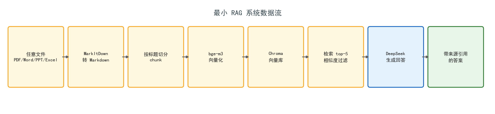

# 我把自己的资料库变成了一个能问答的 AI：最简 RAG 实践

> 文章定位：实践复盘 · 读者：会一点 Python、没搭过 RAG 的人 · 配图见文末

## 起因：资料越攒越多，AI 却一问三不知

我的硬盘里躺着各种 PDF、Word、PPT 和 Excel——产品手册、技术文档、会议纪要、攒了好几年的收藏。每次想找点什么，都得在文件夹里翻半天。

更气人的是，我把资料丢给 DeepSeek 问，它要么说"我不知道"，要么一本正经地给我编：

> 问：单文件大小限制是多少？
> 答：根据资料，单个文件的大小限制为 **100MB**。

可我的资料里明明写着 50MB。

原因不复杂：大模型的知识是训练时"记住"的，它从没见过我的私有文档。想让 AI 读我的资料，有两条路——微调，或者 RAG。微调成本高、资料一更新就得重训；RAG 是"开卷考试"：先检索出相关资料，再让模型基于资料回答。

对个人知识库来说，RAG 是性价比最高的方案。于是我搭了一套最小可用的 RAG 系统，整个数据流是这样的：



> 任意文件 → Markdown → 按标题切分 → bge-m3 向量化 → Chroma 检索 → DeepSeek 生成 → 带来源引用的回答

下面按环节讲讲我做了什么、为什么这么选、踩了什么坑。

## 第一步：先把任意文件变成 Markdown

RAG 的第一步，是把文档变成模型能"看懂"的文本。我选的是微软开源的 MarkItDown——一个 GitHub 上十几万 star 的工具，能把 PDF、Word、PPT、Excel、图片、音频、网页链接统一转成 Markdown。

```python
from markitdown import MarkItDown

md = MarkItDown()
result = md.convert("docs/产品手册.pdf")
content = result.text_content
```

为什么是 Markdown 而不是纯文本？因为 Markdown 保留了结构——标题、列表、表格、代码块。这些结构在后面的切分环节会派上大用场。

踩过的坑：

- MarkItDown 处理"能提取文字"的 PDF 很好，但扫描件 PDF 本质是图片，它默认不做 OCR，转出来是空的。扫描件需要先接 OCR，或者换成 MinerU 这类自带 OCR 的解析工具。
- 复杂表格和公式会有损失。Markdown 是"LLM 友好"，不是"高保真还原"，够用就好。
- 注意装全扩展：MarkItDown 的 PDF、Word 支持是可选依赖，需要 `pip install "markitdown[pdf,docx]"`，不然会报"缺少依赖"。

## 第二步：按标题切分，而不是按字数硬切

这一步是整个系统里我认为最值得说的设计。

很多教程教你按固定长度切块，比如每 500 个字切一块。但这样切出来的块语义是碎的——一句话可能从中间被切开，检索时经常找不到上下文。

因为我第一步把文档统一成了 Markdown，就可以**按标题层级切分**：遇到 `#`、`##` 就开一个新块，把标题一起带进去。这样每个块自带语义边界，检索命中时，连"这一段属于哪个章节"都知道了。

```python
import re

def chunk_by_heading(md_text, max_chars=800):
    """按 Markdown 标题切分；超长章节按长度硬切，chunk 保留标题前缀。"""
    chunks, heading_stack, buf = [], [], ""

    def flush():
        if buf.strip():
            chunks.append(buf.strip())
        return ""

    for line in md_text.splitlines():
        m = re.match(r"^(#{1,6})\s+(.*)", line)
        if m:
            buf = flush()
            level, title = len(m.group(1)), m.group(2).strip()
            heading_stack = heading_stack[: level - 1] + [title]
            buf = line + "\n"
        else:
            buf += line + "\n"
            while len(buf) > max_chars:      # 超长硬切兜底
                cut = max(buf.rfind("\n", 0, max_chars), 1)
                chunks.append(buf[:cut].strip())
                buf = buf[cut:].lstrip("\n")
    flush()
    return chunks
```

我的参数：块上限 800 字符。实测 3 份文档转出 23 个块，每个块都带上了"产品手册 > 五、退款政策"这样的标题上下文。

## 第三步：Embedding，把文本变成向量

检索的本质是找"语义相近的段落"。Embedding 模型把文本变成一串数字（向量），语义相近的文本，向量距离就近。

我用的是开源模型 bge-m3（BAAI 出品），本地 CPU 跑，不需要 GPU，也不需要花钱。选它主要看三点：中文效果好、能完全本地运行（隐私加零成本）、社区验证多。

```python
from sentence_transformers import SentenceTransformer

model = SentenceTransformer("BAAI/bge-m3")
vec = model.encode(["文本"], normalize_embeddings=True)[0]
```

一个小提醒：国内网络从 HuggingFace 下载模型经常失败，可以用 ModelScope 下载后指向本地路径，或者设置 `HF_ENDPOINT=https://hf-mirror.com`。

## 第四步：向量库与检索

向量存进 Chroma——一个开源的本地向量数据库，自带持久化和 metadata，不需要单独起服务。查询时把问题也转成向量，算余弦相似度，取最相关的几个块。

```python
import chromadb

client = chromadb.PersistentClient(path="./data/kb")
collection = client.get_or_create_collection("rag_kb",
    metadata={"hnsw:space": "cosine"})

hits = collection.query(
    query_embeddings=[question_vec],
    n_results=5,                       # top-k = 5
    include=["documents", "metadatas", "distances"])
```

我的参数：top-k 取 5，相似度阈值 0.35——低于阈值的直接不采用。宁可不答，也不能拿不相关的资料去误导模型。检索命中的块会带上来源 metadata（文件名 + 章节），这是后面溯源的关键。

一个坑：纯向量检索对"精确关键词"不敏感。比如你搜一个型号 "A-100" 或某个人名，语义相近的段落里可能根本不含这个词。这是纯向量方案的天然短板，我后面会说解法。

## 第五步：DeepSeek 生成，关键是管住它别编

检索到的块拼进提示词，交给 DeepSeek。选它的原因很简单：便宜、中文好，而且兼容 OpenAI 的 API 协议——用 openai 的 SDK 改个 base_url 就能调。

```python
from openai import OpenAI

client = OpenAI(api_key="你的key", base_url="https://api.deepseek.com")

resp = client.chat.completions.create(
    model="deepseek-chat",
    temperature=0.3,
    messages=[
        {"role": "system", "content": "只依据【资料】回答；资料里没有的，明确说不知道；"
                                      "回答末尾用 [1][2] 标注引用编号。"},
        {"role": "user", "content": f"【资料】\n{context}\n\n【问题】\n{question}"},
    ],
)
```

防幻觉三板斧：

1. 提示词里写死"只依据资料，没有就说不知道"；
2. temperature 调低到 0.3，少留自由发挥空间；
3. 要求它标出引用编号——既方便读者溯源，也逼它真的去读资料。

## 实测：同一批问题，裸问 vs 走 RAG

我用 3 份演示文档（PDF 产品手册、Word 使用指南、Excel 常见问题）建好知识库，问了 8 个真实问题，对比"直接问 DeepSeek"和"走 RAG 检索后再问"。

最典型的四个：

**1. 单文件大小限制是多少？**

裸问：根据资料，单个文件的大小限制为 **100MB**。

RAG：根据资料，单文件最大 50MB。[1]

→ 裸问把 50 编成了 100。这种"看着合理其实错了"的幻觉最危险。

**2. 知识库的权限角色有哪几种？**

裸问：管理员、编辑者、查看者。

RAG：所有者、管理员、编辑者、只读；所有者拥有全部权限，可删除知识库。[1]

→ 裸问少说了一个角色、还把"只读"说成"查看者"。

**3. 产品的退款政策是什么？**

裸问：资料中没有相关内容，无法回答。

RAG：订阅后 7 天内可申请全额退款；超过 7 天按剩余天数比例退款；退款原路返回，到账时间一般为 3~5 个工作日。[1]

→ 退款政策明明写在产品手册第五章，裸问却说"没有相关内容"——不是不会，是它压根没看过。

**4. 导入失败一般是什么原因？**

裸问：文件格式不支持、数据格式错误、字段不匹配、数据量过大……

RAG：检查文件格式与大小限制（单文件不超过 50MB）；扫描版 PDF 需先做 OCR 再导入。[1]

→ 裸问编了一套听起来很专业的原因，RAG 给出的是资料里真实写着的排查步骤。

另外 4 个问题（支持格式、离线使用、取消订阅、团队版成员数），裸问要么答不全要么直接说"没有相关资料"，RAG 全部命中正确来源。

结论很直接：**裸问的 DeepSeek 像一个没有看过资料的实习生，自信地胡说；走 RAG 之后，它变成了一个手里拿着资料、逐条给你指出处的助手。**

## 这套系统的边界

诚实地说，这是"最小可用"，不是"生产级"。目前的短板：

- 扫描 PDF 需要 OCR 前置；
- 没有重排（rerank），召回结果质量一般；
- 没有多轮对话记忆，追问会失忆；
- 纯向量检索对精确关键词不友好。

我的下一步路线：

1. 混合检索：BM25 关键词 + 向量检索，结果做 RRF 融合；
2. 加 cross-encoder 重排，top-20 重排到 top-5；
3. 多轮对话：把历史对话也纳入检索；
4. 增量更新：文件变了自动重新索引。

## 结尾：一套可复制的 MVP

如果看完你也想搭一个，最小清单是：

1. MarkItDown 把文件转成 Markdown；
2. 按标题切分（复用上面的 `chunk_by_heading`）；
3. 一个 embedding 模型（bge-m3）；
4. 一个向量库（Chroma 或 FAISS 都行）；
5. DeepSeek API。

整套下来，除了 API 调用费，几乎没有成本。完整可运行的代码放在 [rag-mini 工程](https://github.com/你的仓库/rag-mini)，核心逻辑就是上面这几段。

资料是越攒越多的，但知识库一旦搭起来，是越用越值钱的。你的硬盘里那些"以后再看"的文件，也许就差这一步。
